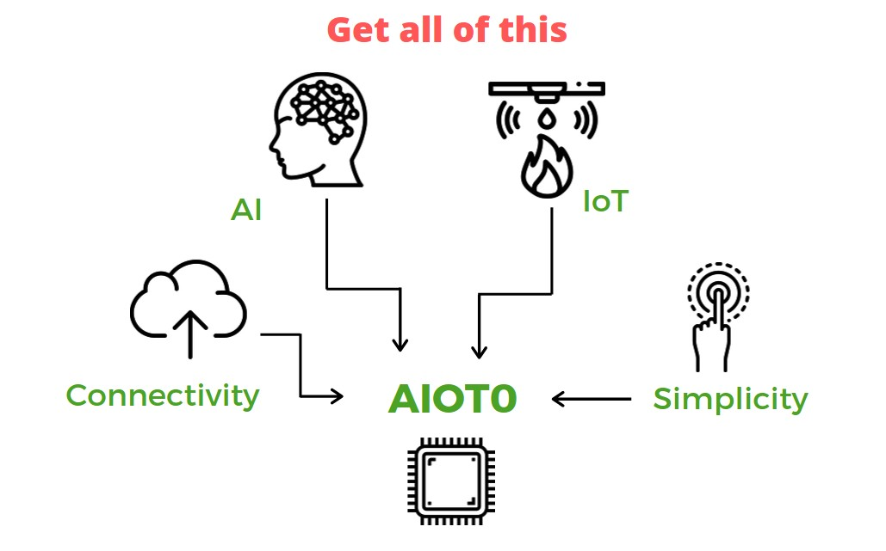

# AIOT0

## KNOW US
Raspberry Pi rocked the IoT world with its low cost, simplified SBC solution that helped many prototype
an IoT solution.
Excellent job for 2012, 7 years ago this was a very needed solution for **makers and prototypers**.

## What next for AIOT?
**AIOT0**: A new low cost board for AIoT market with additional features :

1. Industry Ready SoC 
2. Custom Linux for IoT & AI
3. Less than 5 lines of Code to integrate any AI or IoT function

## AI 

## IoT

## Connectivity 

### Optimized for ARMv8 
Each block of code written with ARMv8 in mind. 
MISRAC/Kernel Coding style compliant.

## Not Impressed, Yet ?
Guess what, You get all of this at the price of 9.9 USD only.

